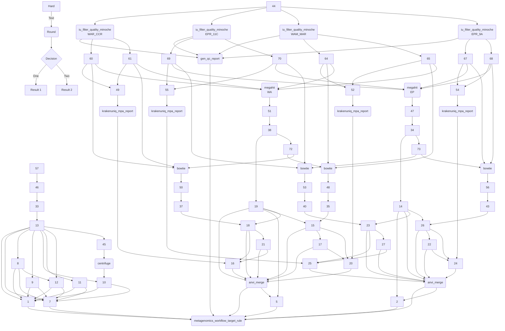

Welcome. This site provides the reproducible bioinformatics workflow for our study on the Transisthmian water column microbiome project. Here you will find details on how we setup our computational environment, program names and exact parameters we used throughout every step of the analysis, and how to access raw data. In addition we provide field/lab methods, summary data products, and other (potentially) useful information. Below

Use the buttons at the top of the page or [this link](/projects/trans-water/) to access the molecular data and complete bioinformatic workflow.

 

{}

SYNOPSIS

In this study, we

- Investigate the evolution of free-living marine microbes of both sides of the Isthmus of Panama; the Eastern Pacific (EP) & Western Atlantic (WA).
- Collected a total of 57 water column samples collected from mangroves and coral reefs, dominant benthic habitats.
- Each sample (4L) was filtered through a 0.22 micron filter. DNA was extracted from the filters and used for metagenomic sequencing.
-  Performed separate co-assemblies for EP samples and for WA samples.
-  Used automatic and manual binning to generate metagenome assembled genomes (MAGs) from each assembly.

{}

